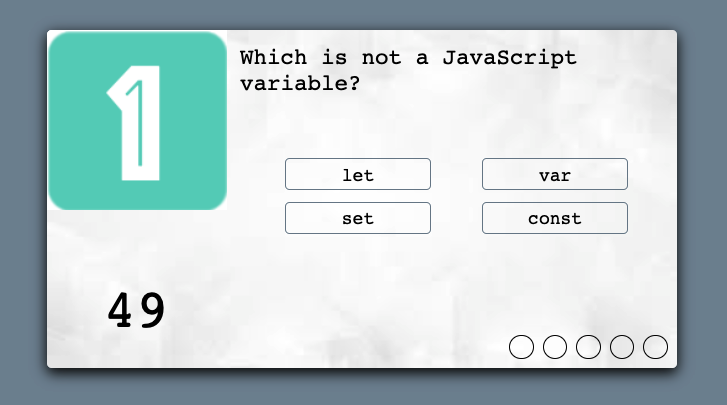
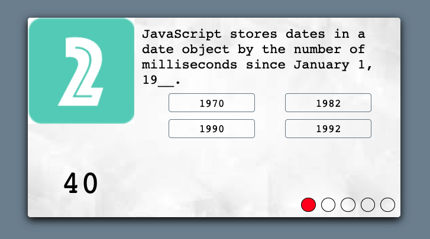
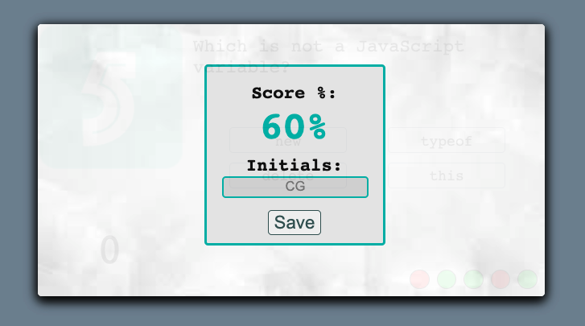

# Beat-the-Timer

> If you are not willing to learn, no one can help you. If you are determined to learn, no one can stop you. -Zig Ziglar

---
## JavaScript Code Quiz
- Take a timed quiz on JavaScript fundamentals and store your high score to gauge your progress. An extra bonus: you can compare high scores with yours peers!

---
## Description 
- **Beat the Timer** is a Quiz on JavaScript fundamentals. Once you start the quiz a 1 min countdown starts. If you answer a question correctly - your current progress bubble turns green and you move onto the next question. If you answer a question incorrectly - the timer deducts 10 seconds and your current progress bubble turns red (BUT you still get to move onto the next question and try to redeem yourself). UNLESS...You run out of questions OR you run out of time. Then the Quiz Ends. Save your score and compare with other quiz takers. 

- I used HTML, CSS, and JavaScript. 

- In the future I plan on adding some CSS Framework and more JavaScript. I would like to add more questions to the current quiz as well as creating other quizes to choose from.

---

## **Link** and **Preview** of Deployed Web Page

- [Deployed Web Page](https://caitlyn-griffing.github.io/PutNameHere----------/)

---

## Important Links

- [Deployed URL](https://caitlyn-griffing.github.io/PutNameHere----------/)
- [GitHub Repo](https://github.com/caitlyn-griffing/PutNameHere----------)

---

## Licensing

- [MIT](https://github.com/caitlyn-griffing/PutNameHere----------/blob/main/LICENSE)

---

## Contact Information

Caitlyn Griffing

- 469-278-6558

- griffingcaitlyn@gmail.com

[Click to Schedule a *Call With Me!*](https://calendly.com/caitlyngriffing/15min)
